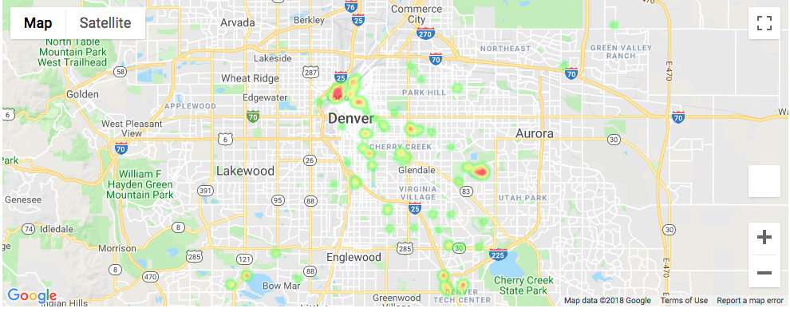
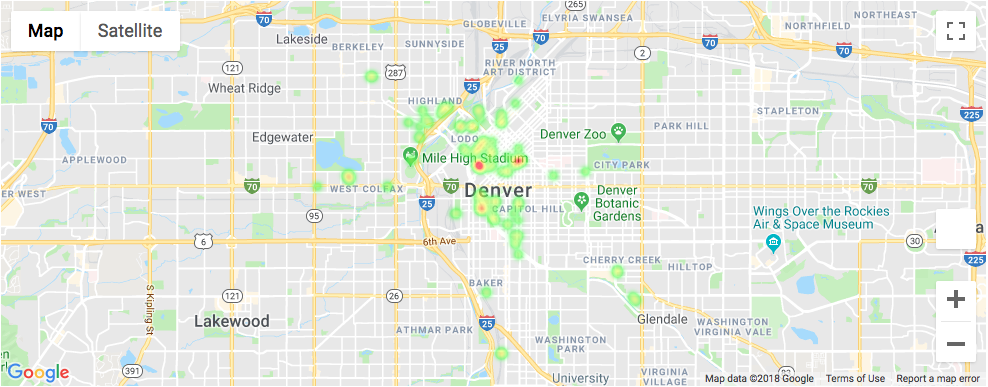
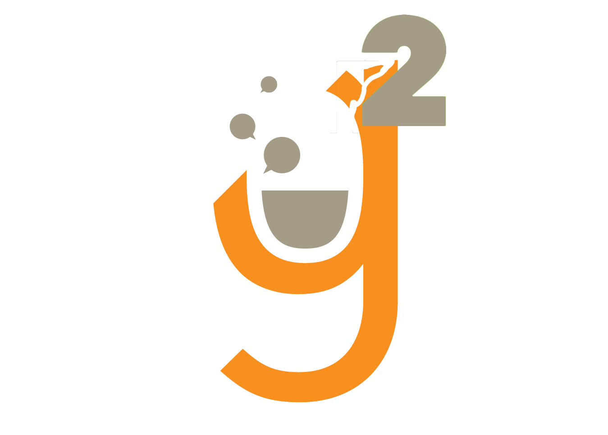

# Farmers' Market Need
## Project Goals
For this project, our team mapped the best places for Farmer's Markets in Denver. We defined best places for Farmer's Markets as places with the highest address density that are not currently zoned for Farmer's Markets.

## Why Farmers' Markets
Farmer's Markets encourage sustainable farming practices, provide an affordable way to access locally grown produce, support local economies, and combat food deserts.  

## Community Use Case
1. City of Denver can use these maps to plan future Farmer's Market locations.
2. Food activists can use these maps to advocate for better zoning laws.
3. Farmer's Market Operators can use these maps to choose locations that serve the most people.
4. The code can be reused by other metro areas in Colorado and across the US with similar data.

## Heat Maps
### Heatmap of High Population Density Areas Not Zoned for Farmers' Markets

### Heatmap of High Population Density Areas Zoned for Farmers' Markets

## Team

- Patrick Hottovy ([LinkedIn](https://www.linkedin.com/in/patrick-hottovy/)) 
- Michelle Lee, PhD ([LinkedIn](https://www.linkedin.com/in/michelleseulkilee/)) 
- Whitney Meer ([LinkedIn](https://www.linkedin.com/in/whitneypmeer/)) 

## Data
We used two Denver Open Data data sources, [Zoning for Farmers' Markets](https://www.denvergov.org/opendata/dataset/city-and-county-of-denver-zoning-for-farmers-markets) and [Addresses](https://www.denvergov.org/opendata/dataset/city-and-county-of-denver-addresses).

## Steps
- Aggregate address level data by latitude and longitude as a proxy for population density. Sort latitude and longitude by population density.

- Use the zoning data to determine if the latitude and longitude is zoned for Farmers' Market use.

- Make a heat map of the addresses that are and are not zoned for farmers' market use.

## Future Work
- Overlay the densities on the actual zoning maps
- Overlay the density maps on maps of food deserts
- Overlay other location data like parks, bike paths and public housing.
- Have a better population density measurement

## Tech Stack
- Python
- Pandas
- JupyterNotebooks
- GeoPandas
- Google Maps API
